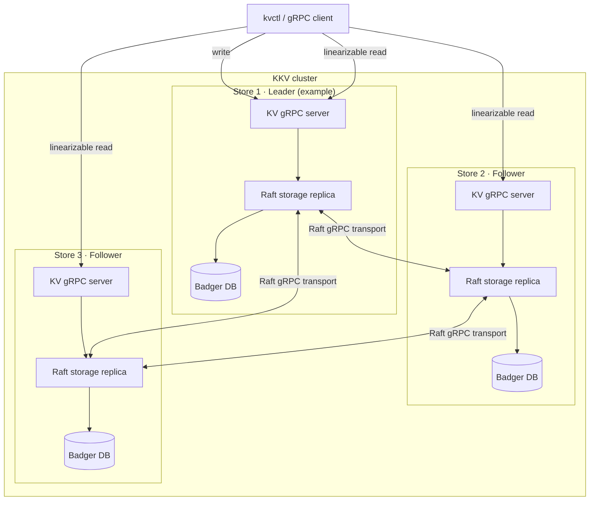

# KKV

[中文](README.zh-CN.md)

KKV is a distributed key-value store written in Go. It uses Raft log replication to keep replicas consistent and exposes a gRPC KV API.

## Features

- Raft-based replicated storage
- Linearizable reads with ReadIndex and leader lease
- Pre-vote, quorum checks, and Raft log compaction
- Badger-backed local persistence
- `Get`, `Put`, `Delete`, and `Scan` operations
- Logical keyspace isolation through the `cf` parameter
- gRPC server and `kvctl` command-line client
- Mutual TLS encryption and authentication

## Quick start

### Prerequisites

- Go 1.25 or later
- `protoc`, `protoc-gen-go` v1.36.11, and `protoc-gen-go-grpc` v1.6.1 (only needed to regenerate Protobuf code)

### Build and test

```bash
git clone https://github.com/Aetherance/kkv.git
cd kkv

go test ./...
go build ./cmd/kv
go build ./cmd/kvctl
```

Or use the Makefile:

```bash
make test
make fmt
make generate
```

### Run a single-node server

```bash
go run ./cmd/kv \
  -store-id 1 \
  -data-dir /tmp/kkv-1 \
  -peers '1=127.0.0.1:20161'
```

The server listens on `127.0.0.1:20161`.

### Use the command-line client

In another terminal, run:

```bash
# Write a value
go run ./cmd/kvctl -a 127.0.0.1:20161 put default greeting hello

# Read a value
go run ./cmd/kvctl -a 127.0.0.1:20161 get default greeting

# Scan a key range
go run ./cmd/kvctl -a 127.0.0.1:20161 scan -limit 10 default ''

# Delete a value
go run ./cmd/kvctl -a 127.0.0.1:20161 del default greeting
```

`<cf>` identifies a logical keyspace. Use `default` as the default keyspace.

## Run a three-node cluster

Start each node with the same peer list and its own ID and data directory:

```bash
# Terminal 1
go run ./cmd/kv -store-id 1 -data-dir /tmp/kkv-1 \
  -peers '1=127.0.0.1:20161,2=127.0.0.1:20162,3=127.0.0.1:20163'

# Terminal 2
go run ./cmd/kv -store-id 2 -data-dir /tmp/kkv-2 \
  -peers '1=127.0.0.1:20161,2=127.0.0.1:20162,3=127.0.0.1:20163'

# Terminal 3
go run ./cmd/kv -store-id 3 -data-dir /tmp/kkv-3 \
  -peers '1=127.0.0.1:20161,2=127.0.0.1:20162,3=127.0.0.1:20163'
```

After election, send write requests to the leader. A write sent to a follower returns a `not leader; leader=<id>` error; use the ID-to-address mapping in `-peers` to connect to that leader. Read requests can be sent to any replica: a follower obtains a ReadIndex from the leader, waits until its local state has applied that index, and then serves the read locally with linearizable consistency.

## Mutual TLS

Plaintext gRPC remains the default. Once certificate options are supplied, KKV uses mutual TLS to encrypt and authenticate both client traffic and Raft traffic. Configure every node with a certificate, key, and trusted CA:

```bash
go run ./cmd/kv -store-id 1 -data-dir /tmp/kkv-1 \
  -peers '1=127.0.0.1:20161' \
  -tls-cert certs/node1.pem \
  -tls-key certs/node1-key.pem \
  -tls-ca certs/ca.pem

go run ./cmd/kvctl -a 127.0.0.1:20161 \
  -tls-ca certs/ca.pem \
  -tls-cert certs/client.pem \
  -tls-key certs/client-key.pem \
  get default greeting
```

The KV and Raft services share one gRPC port, so mutual TLS applies to both peer nodes and external clients. Each node certificate must be valid for both server and client authentication, and its DNS/IP SAN must match the corresponding address in `-peers`. `kvctl` must provide a client certificate and key; it also supports `-tls-server-name` when the dial address differs from the server certificate name.

TLS requires version 1.2 or later and protects data in transit; it does not encrypt the Badger data directory at rest. All nodes in a cluster must use a compatible transport mode.

## Command reference

```text
kvctl -a <server-address> [mTLS flags] get <cf> <key>
kvctl -a <server-address> [mTLS flags] put <cf> <key> <value>
kvctl -a <server-address> [mTLS flags] del <cf> <key>
kvctl -a <server-address> [mTLS flags] scan [-limit N] <cf> <start-key>
```

## Project layout

```text
cmd/                 Server and kvctl entry points
engine/config/       Node and Raft runtime configuration
engine/storage/      Storage abstraction, Badger, and Raft backends
proto/proto/         gRPC and Raft message definitions
proto/pkg/           Generated Protobuf Go code
raft/                Raft protocol implementation
security/            Shared TLS configuration and certificate validation
server/              KV gRPC service implementation
integration/         End-to-end integration tests
```

## Architecture



This diagram shows one example role assignment; any store can become the leader after an election.

## API definition

The KV service is defined in [`proto/proto/kvpb.proto`](proto/proto/kvpb.proto), and its request and response messages are defined in [`proto/proto/kvrpcpb.proto`](proto/proto/kvrpcpb.proto).

After changing a `.proto` file, run:

```bash
go install google.golang.org/protobuf/cmd/protoc-gen-go@v1.36.11
go install google.golang.org/grpc/cmd/protoc-gen-go-grpc@v1.6.1

make generate
```

Ensure the directory containing Go-installed binaries is in `PATH` before running `make generate`.

## Development

```bash
# Format Go source
make fmt

# Run all tests
make test
```
