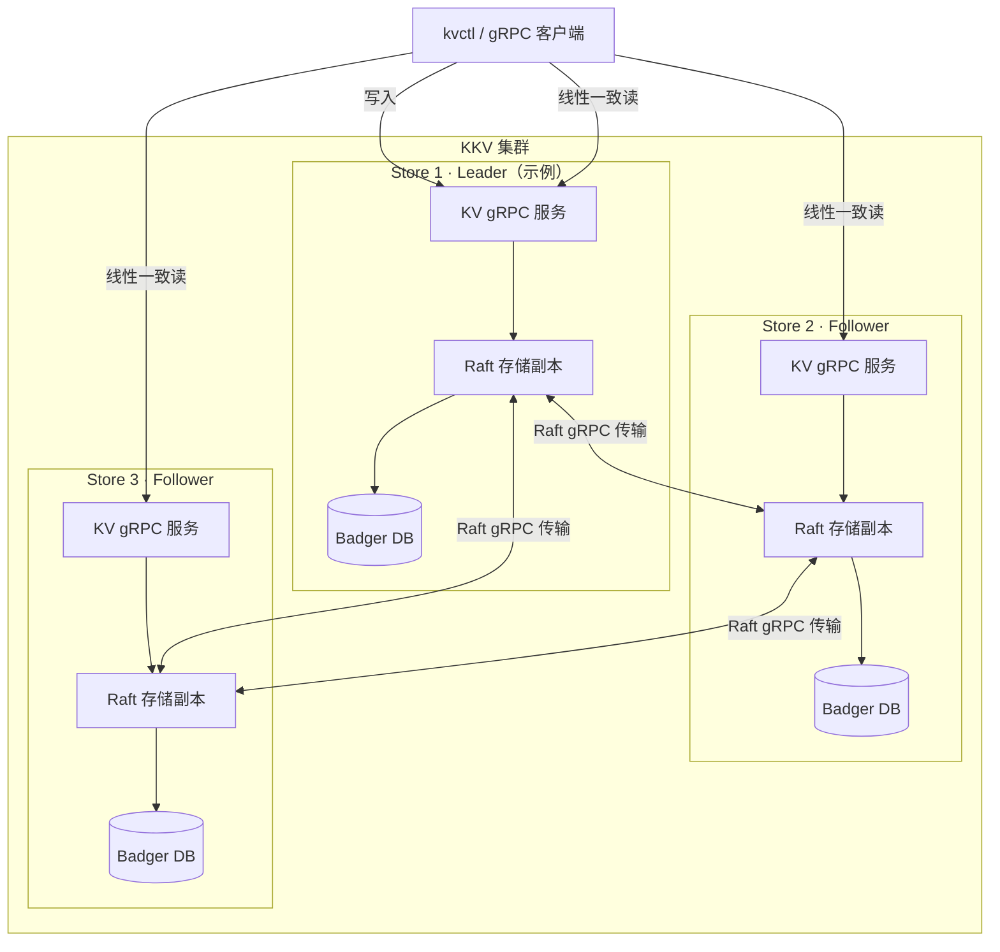

# KKV

[English](README.md)

KKV 是一个基于 Go 实现的分布式键值存储。它使用 Raft 复制日志保证多副本数据一致，并通过 gRPC 提供 KV 读写接口。

## 特性

- 基于 Raft 的多副本一致性复制
- 线性一致读（ReadIndex）与 Leader Lease
- Pre-Vote、Quorum Check 与日志压缩
- 基于 Badger 的本地持久化存储
- 支持 `Get`、`Put`、`Delete`、`Scan` 操作
- 通过 `cf` 参数隔离逻辑键空间
- 提供 gRPC 服务端与命令行客户端 `kvctl`

## 快速开始

### 环境要求

- Go 1.25 或更高版本
- `protoc`、`protoc-gen-go` v1.36.11 与 `protoc-gen-go-grpc` v1.6.1（仅重新生成 Protobuf 代码时需要）

### 构建与测试

```bash
git clone https://github.com/Aetherance/kkv.git
cd kkv

go test ./...
go build ./cmd/kv
go build ./cmd/kvctl
```

也可以使用 Makefile：

```bash
make test
make fmt
make generate
```

### 启动单节点服务

```bash
go run ./cmd/kv \
  -store-id 1 \
  -data-dir /tmp/kkv-1 \
  -peers '1=127.0.0.1:20161'
```

服务启动后会监听 `127.0.0.1:20161`。

### 使用命令行客户端

另开一个终端执行：

```bash
# 写入
go run ./cmd/kvctl -a 127.0.0.1:20161 put default greeting hello

# 读取
go run ./cmd/kvctl -a 127.0.0.1:20161 get default greeting

# 范围扫描
go run ./cmd/kvctl -a 127.0.0.1:20161 scan -limit 10 default ''

# 删除
go run ./cmd/kvctl -a 127.0.0.1:20161 del default greeting
```

`<cf>` 用于标识逻辑键空间；`default` 可作为默认键空间使用。

## 启动三节点集群

三个节点使用相同的成员列表，并分别配置各自的 ID、数据目录：

```bash
# Terminal 1
go run ./cmd/kv -store-id 1 -data-dir /tmp/kkv-1 \
  -peers '1=127.0.0.1:20161,2=127.0.0.1:20162,3=127.0.0.1:20163'

# Terminal 2
go run ./cmd/kv -store-id 2 -data-dir /tmp/kkv-2 \
  -peers '1=127.0.0.1:20161,2=127.0.0.1:20162,3=127.0.0.1:20163'

# Terminal 3
go run ./cmd/kv -store-id 3 -data-dir /tmp/kkv-3 \
  -peers '1=127.0.0.1:20161,2=127.0.0.1:20162,3=127.0.0.1:20163'
```

选举完成后，写请求发送到 Leader 节点。向 Follower 发送写请求会返回 `not leader; leader=<id>` 错误；根据 `-peers` 中的 ID—地址映射连接对应 Leader。读请求可发送到任意副本：Follower 会向 Leader 获取 ReadIndex，等待本地状态机应用至该索引后，再以线性一致性从本地返回数据。

## 命令行参考

```text
kvctl -a <server-address> get <cf> <key>
kvctl -a <server-address> put <cf> <key> <value>
kvctl -a <server-address> del <cf> <key>
kvctl -a <server-address> scan [-limit N] <cf> <start-key>
```

## 项目结构

```text
cmd/                 服务端与 kvctl 命令行入口
engine/config/       节点与 Raft 运行配置
engine/storage/      存储抽象、Badger 与 Raft 存储实现
proto/proto/         gRPC 与 Raft 消息定义
proto/pkg/           生成的 Protobuf Go 代码
raft/                Raft 协议实现
server/              KV gRPC 服务实现
integration/         端到端集成测试
```

## 架构



此图展示一次运行时的角色分配示例；选举后任意 Store 都可以成为 Leader。

## API 定义

KV 服务定义位于 [`proto/proto/kvpb.proto`](proto/proto/kvpb.proto)，请求与响应消息定义位于 [`proto/proto/kvrpcpb.proto`](proto/proto/kvrpcpb.proto)。

修改 `.proto` 文件后，运行：

```bash
go install google.golang.org/protobuf/cmd/protoc-gen-go@v1.36.11
go install google.golang.org/grpc/cmd/protoc-gen-go-grpc@v1.6.1

make generate
```

运行 `make generate` 前，请确保 Go 安装的二进制目录已加入 `PATH`。

## 开发

```bash
# 格式化
make fmt

# 运行全部测试
make test
```
